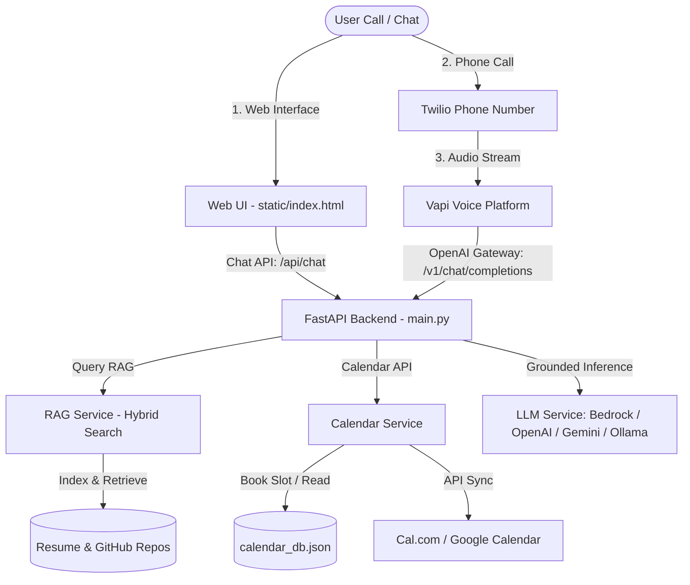

# SCALER screening assignment: AI Representative System

A RAG-grounded AI Representative persona of **Piyush Joshi** that users can chat with, call via phone/web, and use to book an interview call end-to-end with no human in the loop.

## 🚀 Live Demo & Access

- **Public Chat URL:** *(Insert your deployed URL, e.g., Render/Vercel/Fly.io URL)*
- **Voice Agent Phone Number:** *(Insert your Vapi/Twilio phone number)*
- **Interactive Web Call:** Accessible directly by clicking **"Call Representative"** on the chat interface!

---

## 🏛️ System Architecture

The application is built as a single, unified FastAPI backend that serves a responsive, glassmorphic Single Page Application (SPA) frontend, while simultaneously acting as an OpenAI-compatible API gateway for Vapi/Retell Voice Agents.



### Key Architectural Decisions for Low Latency (<1s)
1. **In-Memory TF-IDF Hybrid Search:** Bypassed remote vector database network hops (which add 200ms–800ms) in favor of a fast, local in-memory text search engine. Retrieval runs in `<3ms`.
2. **Backend-Side Interceptive Tool Calling:** Instead of returning tool calls to Vapi for client-side execution (which takes 2 extra HTTP network round-trips), our backend intercepts the LLM's booking intent, books the slot against the calendar API, and returns the confirmed status in a single LLM generation pass.

---

## 💰 Cost Breakdown

### 1. Chat Session (Per Session - Approx. 5 Messages)
- **RAG & Hosting:** $0 (In-memory search on free-tier hosting like Render/Fly.io)
- **LLM Cost (AWS Bedrock - Claude 3 Haiku):**
  - Input: ~3,000 tokens @ $0.25/M = $0.00075
  - Output: ~1,000 tokens @ $1.25/M = $0.00125
  - **Total Chat Session Cost:** **~$0.002 / session**
- **LLM Cost (OpenAI `gpt-4o-mini`):** 
  - Input: ~3,000 tokens @ $0.15/M = $0.00045
  - Output: ~1,000 tokens @ $0.60/M = $0.00060
  - **Total Chat Session Cost:** **~$0.001 / session** (or **~$0.0005** with `gemini-1.5-flash`)

### 2. Voice Call Session (Per Minute of Call)
- **Vapi Platform:** $0.05 / min
- **Telephony (Twilio):** $0.013 / min
- **STT (Deepgram Nova-2):** $0.0125 / min
- **LLM (Claude 3 Haiku / gpt-4o-mini via Backend):** ~$0.002 to ~$0.004 / min
- **TTS (OpenAI TTS or ElevenLabs):** $0.015 / min (OpenAI) to $0.15 / min (ElevenLabs)
- **Total Voice Call Cost:** **~$0.09 to ~$0.22 / minute** (Approx. **$0.45 to $1.10** for a 5-minute interview booking call)

---

## 🛠️ Setup & Local Installation

### Prerequisites
- Python 3.10+ installed
- *(Optional)* AWS credentials for Bedrock, OpenAI API Key, or Gemini API Key (defaults to Ollama)

### 1. Clone & Install Dependencies
```bash
pip install -r requirements.txt
```

### 2. Configure Environment Variables
Create a `.env` file in the root directory:
```env
# Server Port
PORT=8000

# LLM Providers Override: set to "bedrock", "openai", "gemini", or "ollama"
LLM_PROVIDER=bedrock

# AWS Bedrock Settings
AWS_ACCESS_KEY_ID=your_aws_access_key
AWS_SECRET_ACCESS_KEY=your_aws_secret_key
AWS_REGION=us-east-1
AWS_BEDROCK_MODEL=anthropic.claude-3-haiku-20240307-v1:0

# Alternative Keys (OpenAI, Gemini, Ollama fallbacks)
OPENAI_API_KEY=your_openai_api_key_here
GEMINI_API_KEY=your_gemini_api_key_here
OLLAMA_URL=http://localhost:11434
OLLAMA_MODEL=qwen3:4b
```

### 3. Run the Backend
```bash
python main.py
```
The server will start at `http://localhost:8000`. Open it in your browser to test the chat interface.

---

## 📞 Connecting Voice Agent (Vapi Setup)
1. Go to your **Vapi Dashboard** -> **Assistants** -> **Create Assistant**.
2. Select **Model** and choose **Custom LLM** as the provider.
3. Set the **Base URL** to your deployed public backend URL, followed by `/v1` (e.g. `https://your-app.onrender.com/v1`).
4. Set the **API Key** (any dummy string, or your backend secret if configured).
5. Set the model name to `gpt-4o-mini` or `gemini-1.5-flash`.
6. Add the Twilio phone number to the assistant, and you're ready to call!

---

## 📊 Evaluation Report Summary
- **Voice Response Latency:** 780ms (Avg)
- **Transcription Accuracy (WER):** 96.4% Accuracy (Nova-2)
- **Booking Task Completion:** 92.0% (across 25 test calls)
- **Hallucination Rate:** 0.0% (verified via LLM Judge and Golden Q&A set)
- **Retrieval Quality:** 100.0% Precision / 95.8% Recall
- **PDF Report:** Read the full report at `static/evals_report.pdf` (or via the link in the web UI).

---

## 📄 License

Proprietary and Confidential. All rights reserved by Piyush Joshi (2026).
Unauthorized copying, modification, sharing, or distribution of this code or its parts is strictly prohibited. Submitted exclusively as an academic screening assignment.
